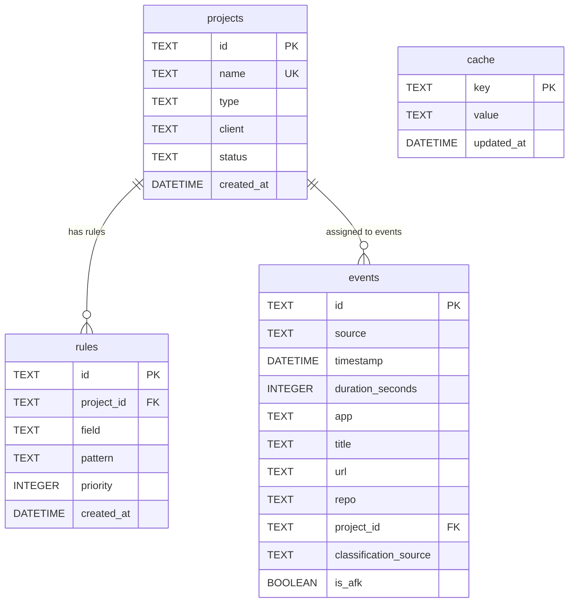

# Tally Database Schema & Storage

Tally uses a local SQLite database (`~/.tally/tally.db`) driven by `modernc.org/sqlite` (pure Go SQLite implementation without CGO requirements). The storage layer is organized into modular stores under `internal/store/`.

## Schema Definition

Defined in `internal/store/schema.go`, the database initializes with schema migrations creating four core tables and supporting indexes:

### Table Specifications

1. **`projects` (`projects.go`)**:
   - `id`: Unique project identifier (UUID or slug).
   - `name`: Human-readable project name (must be unique).
   - `type`: Project categorization (e.g., `billable`, `internal`).
   - `client`: Optional client name for billing.
   - `status`: Project lifecycle state (`active`, `archived`).
   - `created_at`: Timestamp of creation.

2. **`rules` (`rules.go`)**:
   - `id`: Rule identifier.
   - `project_id`: Foreign key referencing `projects(id)` ON DELETE CASCADE.
   - `field`: Target field for pattern matching (`app`, `title`, `url`, `repo`).
   - `pattern`: Substring or glob pattern to match against event signals.
   - `priority`: Numeric priority determining evaluation order.
   - `created_at`: Timestamp of creation.

3. **`events` (`events.go`)**:
   - `id`: Event unique hash/ID (derived from source and timestamp to prevent duplicates).
   - `source`: Capture origin (e.g., `activitywatch`).
   - `timestamp`: Start time of the event.
   - `duration_seconds`: Duration of the event in seconds.
   - `app`: Application name (e.g., `Visual Studio Code`, `Google Chrome`).
   - `title`: Window title or document title.
   - `url`: Browser URL if applicable.
   - `repo`: Extracted git repository name.
   - `project_id`: Foreign key referencing `projects(id)` ON DELETE SET NULL.
   - `classification_source`: Origin of assignment (`rule`, `llm`, `manual`, or empty/unclassified).
   - `is_afk`: Boolean flag indicating idle/away-from-keyboard status.

4. **`cache` (`cache.go`)**:
   - Key-value store for transient application state and sync high-water marks (e.g., last synced timestamp from ActivityWatch).

## Persistence Operations & Stores

- **`store.go`**: Database connection manager, handles opening `~/.tally/tally.db`, executing pragmas (WAL mode, foreign keys enabled), and running schema migrations.
- **`projects.go`**: Provides CRUD operations for projects (`CreateProject`, `GetProject`, `ListProjects`, `ArchiveProject`).
- **`rules.go`**: Manages classification rules (`CreateRule`, `ListRules`, `DeleteRule`, `TestRule`).
- **`events.go`**: Handles batch insertion of events (`UpsertEvents`), querying unclassified events, filtering events by date range, and updating project assignments (`UpdateEventProject`).
- **`cache.go`**: Simple KV get/set for sync cursors.

## Invariants & Transactions

- **Foreign Key Constraints**: Enabled on every connection (`PRAGMA foreign_keys = ON;`). Deleting a project cascades deletion to associated classification rules and sets `project_id` to `NULL` for associated events.
- **Deduplication**: Event IDs are deterministically generated based on source and timestamp, allowing safe idempotent upserts during `tally sync`.
- **Concurrency**: SQLite WAL (Write-Ahead Logging) mode is enabled to support concurrent read access from the web server and MCP background tasks while writes occur.

## Related Pages

- [Architecture Overview](overview.md)
- [Core Orchestration](../core/workflow.md)
- [Classification Engine](../classification/engine.md)
- [Capture & ActivityWatch Integration](../capture/activitywatch.md)
