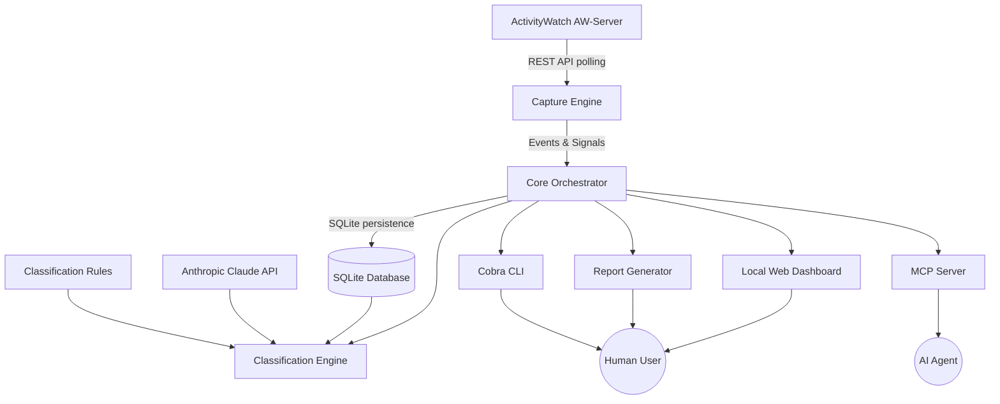
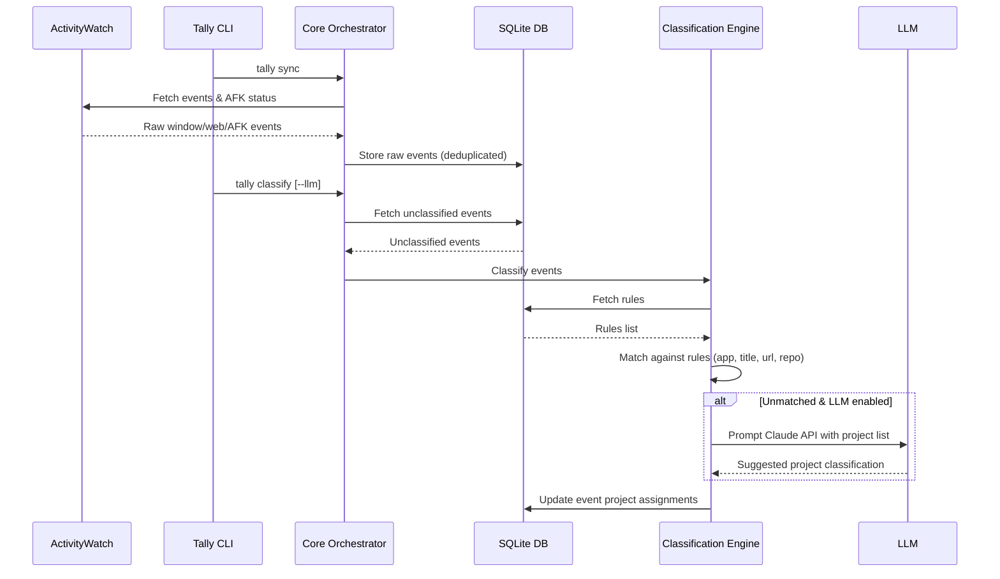

# Tally Architecture Overview

Tally is an automatic, local-first time tracker designed for multi-project builders and AI coding agents. It passively captures activity via [ActivityWatch](https://activitywatch.net/), cleans idle/AFK periods, extracts structural signals (such as git repository names from window titles and web domains from URLs), classifies time into billable or internal projects using deterministic rules and optional LLM assistance, and exposes the data through a CLI, a local web dashboard, and an MCP server.

## System Components

### Core Subsystems

1. **Capture (`internal/capture`)**: Communicates with the local ActivityWatch server to fetch window, web, and AFK events, filtering out idle time and extracting rich signals (`signals.go`) such as repository identifiers and web domains.
2. **Storage (`internal/store`)**: Manages the local SQLite database (`~/.tally/tally.db` via `modernc.org/sqlite`) storing projects (`projects.go`), rules (`rules.go`), events (`events.go`), and KV cache (`cache.go`).
3. **Classification (`internal/classify`)**: Evaluates events against ordered deterministic rules (`engine.go`) and falls back to Anthropic's Claude API (`llm.go`) for ambiguous time entries.
4. **Core Orchestration (`internal/core`)**: Coordinates cross-cutting workflows such as syncing activity, running classification, managing projects and rules, generating reports, and exporting data.
5. **Access Interfaces**:
   - **CLI (`cmd/`)**: Cobra-based command-line interface supporting flags and `--json` machine output.
   - **MCP Server (`internal/mcp`)**: Model Context Protocol server over stdio giving AI agents full parity with human operations.
   - **Web Dashboard (`internal/server`)**: Embedded HTTP server serving a single-page JS application (`internal/server/web`) for visual triage and time review.
   - **Reports (`internal/report`)**: Generates structured hours reports in Markdown, CSV, and JSON.

## Data Flow & Lifecycle

## Security & Privacy Boundary

- **Local-First**: All data is stored locally in SQLite (`~/.tally/tally.db`). No telemetry or tracked activity is transmitted to external servers, with the sole exception of optional LLM classification prompts sent directly to the Anthropic API when explicitly enabled (`--llm`).
- **No Secrets Storage**: Tally stores project metadata, rules, and event intervals; it does not store passwords, tokens, or private keys. The Anthropic API key (if used) is read directly from environment variables (`ANTHROPIC_API_KEY`) and never persisted to the SQLite database.
- **AFK Cleaning**: ActivityWatch idle intervals are subtracted during sync, ensuring that away-from-keyboard time is never billed or tracked as active work.

## Related Pages

- [Database Schema & Storage](database.md)
- [Capture & ActivityWatch Integration](../capture/activitywatch.md)
- [Classification Engine](../classification/engine.md)
- [Core Orchestration](../core/workflow.md)
- [CLI Overview](../cli/overview.md)
- [MCP Server](../mcp/server.md)
- [Web Dashboard](../server/dashboard.md)
- [Report Generator](../reports/generator.md)
- [Testing Suite](../testing/suite.md)
