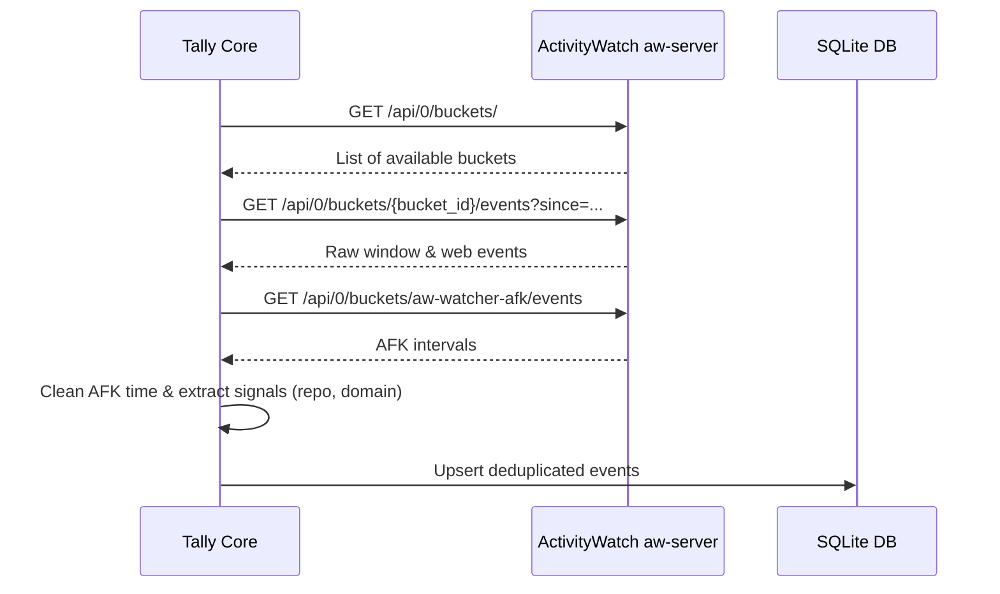

# ActivityWatch Capture & Signal Extraction

Tally relies on [ActivityWatch](https://activitywatch.net/) as its passive capture provider. The capture subsystem is implemented in `internal/capture/` (`activitywatch.go`, `signals.go`, `provider.go`).

## Architecture & REST Client

ActivityWatch runs locally as a background daemon (`aw-server`), typically listening on `http://localhost:5600`. Tally communicates with `aw-server` via its REST API:

1. **Bucket Discovery**: Queries `/api/0/buckets/` to locate active event buckets (e.g., window events `aw-watcher-window`, browser web events `aw-watcher-web`, and AFK events `aw-watcher-afk`).
2. **Event Polling**: Fetches events from buckets since the last synchronization timestamp stored in the SQLite cache.
3. **AFK Filtering**: Queries AFK status buckets (`is_afk == true`) and subtracts or excludes idle intervals from active time tracking.

## Signal Extraction (`signals.go`)

Raw window titles, application names, and browser URLs often contain noisy or unstructured text. Tally's signal extractor (`internal/capture/signals.go`) parses these fields to derive clean structured signals:

- **Git Repository Extraction**: Parses window titles (common in IDEs like VS Code or terminal emulators) to detect repository names matching patterns like `owner/repo` or directory basenames.
- **Domain Extraction**: Parses browser URLs from web watcher events to extract domain names (e.g., `github.com`, `linear.app`).
- **Application Normalization**: Standardizes application names across platforms.

## Error Handling & Fallbacks

- If ActivityWatch is offline or unreachable during `tally sync` or `tally status`, Tally reports a clean connection error rather than crashing, advising the user to verify that ActivityWatch is running.

## Related Pages

- [Architecture Overview](../architecture/overview.md)
- [Database Schema & Storage](../architecture/database.md)
- [Core Workflow](../core/workflow.md)
