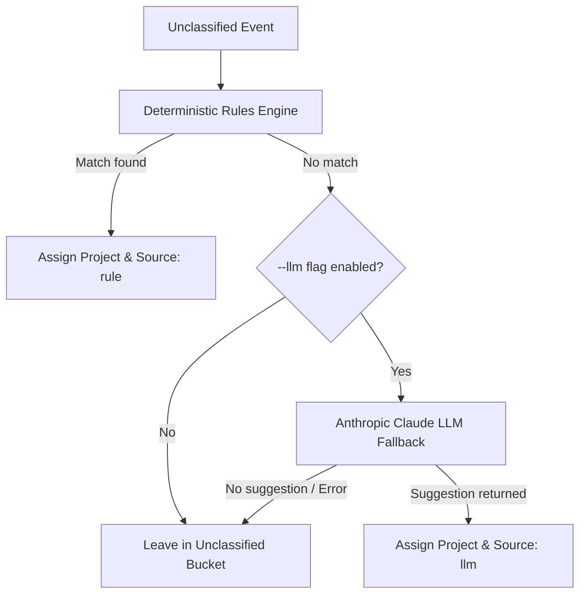

# Classification Engine & LLM Fallback

Tally classifies captured time events into projects using a two-tier approach: **ordered deterministic rules** first, followed by an optional **Anthropic Claude LLM fallback** for ambiguous events (`internal/classify/`).

## Classification Pipeline

## Deterministic Rule Engine (`engine.go`)

Rules are stored in the database (`internal/store/rules.go`) and evaluated in order of priority:

1. **Target Fields**: Rules match against specific event fields:
   - `app`: Application name (e.g., `Slack`, `Xcode`)
   - `title`: Window title substring
   - `url`: Browser URL pattern
   - `repo`: Extracted git repository name
2. **Evaluation**: When `tally classify` runs, each unclassified event is tested against active rules. The first matching rule assigns the corresponding project to the event, setting `classification_source = 'rule'`.

## LLM Fallback (`llm.go`)

When running `tally classify --llm`, events that fail to match any deterministic rule are sent to Anthropic's Claude API (`github.com/anthropics/anthropic-sdk-go`):

- **Prompt Construction**: Sends the event metadata (app, title, url, repo) along with the active project list and their descriptions.
- **Structured Response**: Requests Claude to select the most appropriate project ID.
- **Assignment**: If Claude returns a valid project, the event is assigned with `classification_source = 'llm'`.
- **API Key**: Requires the `ANTHROPIC_API_KEY` environment variable.

## Interactive Triage (`-i` flag)

Running `tally classify -i` opens an interactive terminal prompt allowing human builders to triage unclassified events manually and optionally save their classification decisions as permanent rules so they never recur.

## Related Pages

- [Architecture Overview](../architecture/overview.md)
- [Database Schema & Storage](../architecture/database.md)
- [Core Workflow](../core/workflow.md)
- [CLI Overview](../cli/overview.md)
