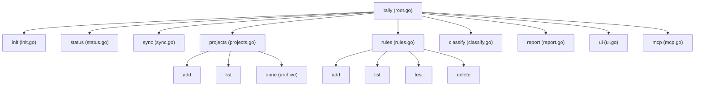

# Tally CLI Overview

Tally provides a rich command-line interface built on [Cobra](https://github.com/spf13/cobra). The CLI entry point is defined in `main.go`, which initializes version metadata and invokes `cmd.Execute()` from `cmd/root.go`.

## Command Hierarchy

## Command Reference

| Command | File | Description | Key Flags |
|---|---|---|---|
| `tally init` | `cmd/init.go` | Creates `~/.tally`, initializes SQLite DB, writes default config, and probes ActivityWatch connection. | None |
| `tally status` | `cmd/status.go` | Reports ActivityWatch connectivity, database stats, and tracked hours summary. | `--json` |
| `tally sync` | `cmd/sync.go` | Pulls recent activity events and AFK status from ActivityWatch into SQLite. | `--json`, `--since` |
| `tally projects` | `cmd/projects.go` | Manage projects (`add`, `list`, `done`). | `--type`, `--client`, `--json` |
| `tally rules` | `cmd/rules.go` | Manage classification rules (`add`, `list`, `test`, `delete`). | `--project`, `--field`, `--priority`, `--json` |
| `tally classify` | `cmd/classify.go` | Run deterministic rules (and optional Claude LLM fallback) on unclassified events. | `--llm`, `--interactive (-i)`, `--json` |
| `tally report` | `cmd/report.go` | Generate per-project hours reports (Markdown, CSV, JSON). | `--week`, `--today`, `--all`, `--format`, `--json` |
| `tally ui` | `cmd/ui.go` | Start local HTTP server and open the web dashboard in the default browser. | `--port` |
| `tally mcp` | `cmd/mcp.go` | Run the Model Context Protocol (MCP) server over stdio for AI agent integration. | None |

## Global Flags & JSON Output

- Every command inherits global flags (such as config path overrides if applicable).
- Nearly every command supports `--json` to output structured JSON for programmatic consumption by scripts or AI agents.

## Related Pages

- [Architecture Overview](../architecture/overview.md)
- [Core Orchestration](../core/workflow.md)
- [MCP Server](../mcp/server.md)
- [Web Dashboard](../server/dashboard.md)
